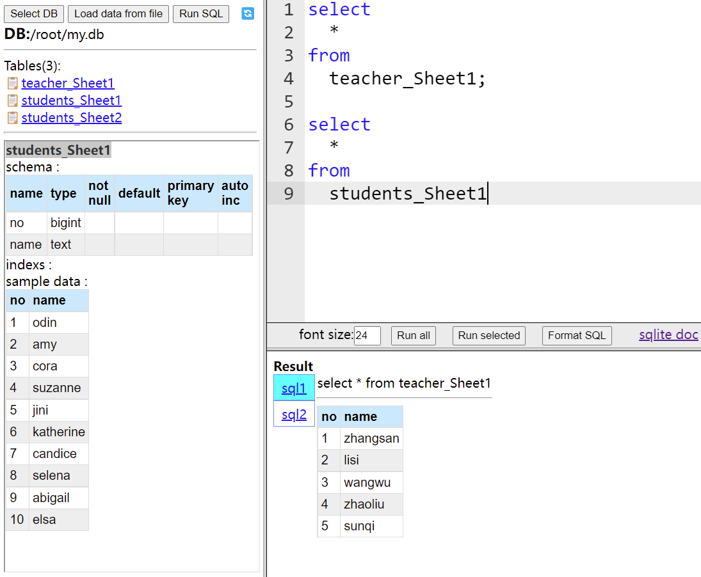

# sqlgo

> sqlite browser and run sql on file (csv and excel file) in command line

## 1. sqlite browser


Feature
 * select db or create new db
 * view tables and schema 
 * view sample data
 * edit sql, format sql and run sql
 * load data from file to table

## 2. run sql on file in command line
> read data (csv or tsv) from stdin and process with sql
```sh
$ ./sqlgo-linux-amd64 -h
Options:

  -h, --help                  display help information
  -s, --sep[=   ]               column separator. default is \t
  -d, --database[=:memory:]   The path of database file. The file will be created when it does not exist.
                                To retain the db file, please provide a path, otherwise, the db in memory will be used.
  -t, --table                 Table define format '[tableName]:[colName1] coltype1,[colName2] coltype2 ...'.
                                Default table name is _t. Default col name is _num(num starts from 1).
                                Default col type is text.
  -e, --exec                 *SQL to be executed。
```
demo: 
>  get max height, min height and average height in excel file. [catexcel](https://github.com/himcc/catexcel) can print excel file to console 
```sh
$ ./catexcel student_height.xlsx -s 0 | ./sqlgo-linux-amd64 -t "name text,height int" -e "select max(height),min(height),avg(height) from _t"
max(height)     min(height)     avg(height)
181     169     174.75
```
If the query is too complex, please use browser mode.The browser mode is convenient for editing SQL.

## Download

[releases](https://github.com/himcc/sqlgo/releases)

## Cross compile (in Windows PowerShell)
```sh
$Env:GOOS = "darwin"; $Env:GOARCH = "amd64"; go build -o sqlgo-darwin-amd64
$Env:GOOS = "linux"; $Env:GOARCH = "amd64"; go build -o sqlgo-linux-amd64
```